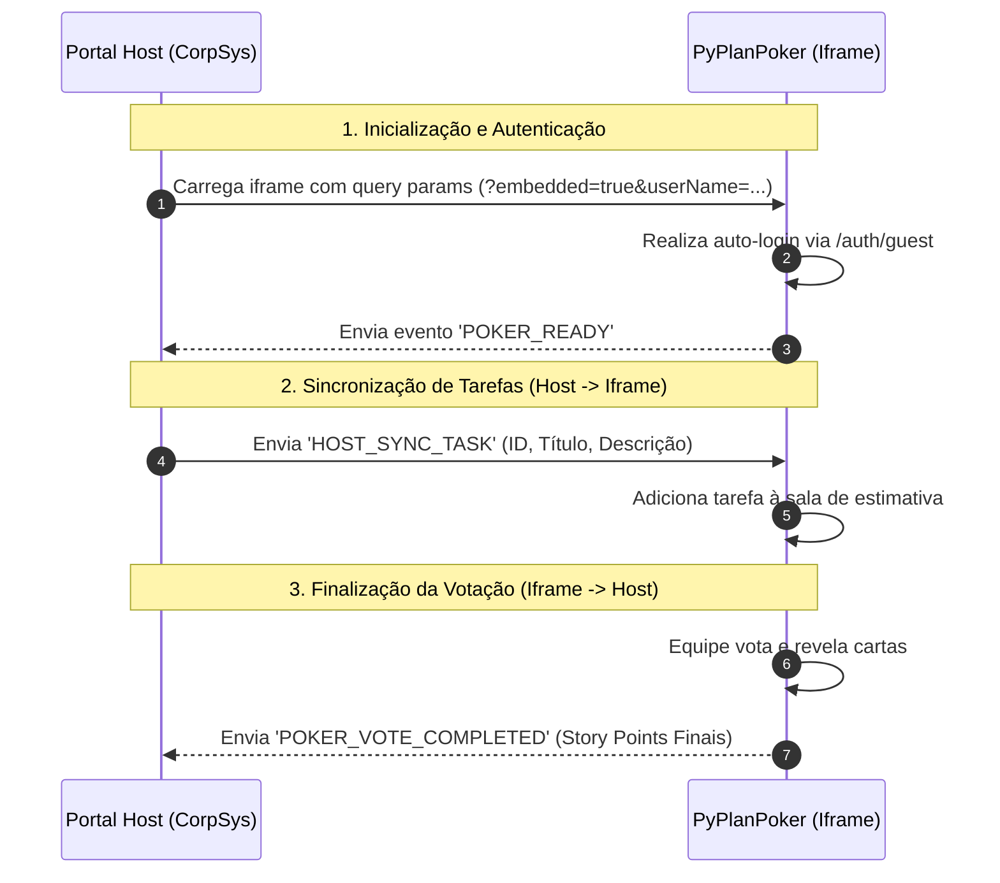

# 🃏 Integração via Iframe (POC Phantom-App)

Esta documentação descreve a arquitetura, o fluxo de comunicação e os detalhes de implementação da integração do **PyPlanPoker** dentro de um portal hospedeiro (Host) via `iframe`.

A prova de conceito (POC) está contida no diretório [phantom-app](file:///c:/Users/mukas/.gemini/antigravity/scratch/PyPlanPoker/phantom-app) e serve como modelo de como integrar o PyPlanPoker em portais corporativos existentes (como o exemplo fictício **CorpSys v2.0**).

---

## 📌 Visão Geral da Arquitetura

A integração utiliza o elemento `iframe` do HTML para renderizar o PyPlanPoker e a API `postMessage` do navegador para comunicação assíncrona, bidirecional e segura em tempo real entre o Portal Host e o PyPlanPoker.



---

## 🔑 1. Inicialização e Autenticação Automática

Para evitar que o usuário precise se autenticar novamente ao acessar o PyPlanPoker dentro do portal corporativo, o sistema implementa um mecanismo de **Auto-Login de Convidado** baseado em parâmetros de URL (Query Strings).

### Parâmetros de URL suportados:
Ao carregar o iframe, o Host deve construir a URL contendo as seguintes chaves:

| Parâmetro | Tipo | Descrição | Exemplo |
| :--- | :--- | :--- | :--- |
| `embedded` | Boolean | Indica que a aplicação está rodando em um iframe. Ativa a escuta e disparo de eventos. | `true` |
| `userName` | String | Nome de exibição do usuário convidado. | `Muka Corp` |
| `avatar` | String (URL) | URL da imagem de avatar do usuário. | `https://github.com/nutlope.png` |

**Exemplo de URL gerada no iframe:**
`http://localhost:3000/?embedded=true&userName=Gerente%20POC&avatar=https%3A%2F%2Fgithub.com%2Fnutlope.png`

### Lógica Interna no PyPlanPoker (`frontend`):
No arquivo [App.jsx](file:///c:/Users/mukas/.gemini/antigravity/scratch/PyPlanPoker/frontend/src/App.jsx#L32-L63):
1. O React detecta `embedded=true` e `userName` na URL usando `URLSearchParams`.
2. Se o usuário não estiver autenticado localmente, dispara uma requisição POST assíncrona para o endpoint `/auth/guest` no backend, enviando o `userName`.
3. O token retornado é armazenado no `localStorage` e o estado do usuário global é definido.
4. Após inicializar com sucesso, o app dispara um evento notificando o Host.

---

## 💬 2. Protocolo de Comunicação (`postMessage`)

A comunicação entre a janela pai (Host) e a janela filha (Iframe) é feita via `window.postMessage`.

### ➡️ Do PyPlanPoker para o Host (Saída)

#### A. Evento: `POKER_READY`
Disparado pelo PyPlanPoker assim que a aplicação é montada e o auto-login (se aplicável) é concluído.
* **Payload:** Não possui payload.
* **Estrutura da mensagem:**
  ```json
  {
    "type": "POKER_READY"
  }
  ```

#### B. Evento: `POKER_VOTE_COMPLETED`
Disparado quando o facilitador finaliza a votação de uma tarefa no PyPlanPoker salvando a estimativa final.
* **Local de Origem:** [Room.jsx](file:///c:/Users/mukas/.gemini/antigravity/scratch/PyPlanPoker/frontend/src/pages/Room.jsx#L161-L171)
* **Estrutura da mensagem:**
  ```json
  {
    "type": "POKER_VOTE_COMPLETED",
    "payload": {
      "taskId": "UUID_DA_TAREFA",
      "title": "Título da Tarefa",
      "finalScore": 5, // Valor selecionado (Story Points)
      "room": "ID_DA_SALA"
    }
  }
  ```

---

### ⬅️ Do Host para o PyPlanPoker (Entrada)

#### A. Evento: `HOST_SYNC_TASK`
Enviado pelo Host para criar ou sincronizar uma tarefa ativamente no backlog do PyPlanPoker.
* **Local de Escuta:** [Room.jsx](file:///c:/Users/mukas/.gemini/antigravity/scratch/PyPlanPoker/frontend/src/pages/Room.jsx#L227-L233)
* **Estrutura da mensagem:**
  ```json
  {
    "type": "HOST_SYNC_TASK",
    "payload": {
      "id": "TASK-102",
      "title": "Implementar API de Pagamento",
      "description": "Desenvolver a integração com o gateway de pagamento Stripe."
    }
  }
  ```
* **Ação Executada:** Ao receber esta mensagem, o PyPlanPoker executa internamente a função `handleAddTask(title, description)` via socket, adicionando o item à lista em tempo real de todos os participantes na sala.

---

## 📁 Estrutura dos Arquivos da POC (`phantom-app`)

A POC é independente e estática, localizada na pasta `/phantom-app`.

* **[config.js](file:///c:/Users/mukas/.gemini/antigravity/scratch/PyPlanPoker/phantom-app/config.js):** Contém as variáveis de ambiente simuladas da POC, como URLs padrão de produção e desenvolvimento, além dos dados do usuário mockado.
* **[index.html](file:///c:/Users/mukas/.gemini/antigravity/scratch/PyPlanPoker/phantom-app/index.html):** A interface da POC que simula o sistema corporativo hospedeiro. Ela renderiza o iframe, gerencia o armazenamento local da URL configurada do PyPlanPoker, exibe logs detalhados das trocas de mensagens e expõe controles para simular o envio de tarefas.

### Componentes de Destaque na POC (`index.html`):
1. **Contêiner do Iframe (`.iframe-container`):** Mostra dinamicamente a URL embarcada e renderiza a aplicação do PyPlanPoker.
2. **Histórico de Eventos (`#event-logs`):** Um console interativo que captura e lista todas as mensagens recebidas do PyPlanPoker (como `POKER_READY` e `POKER_VOTE_COMPLETED`), formatando os payloads em JSON.
3. **Painel de Sincronização (`sendTaskToIframe`):** Botão para disparar o evento `HOST_SYNC_TASK` para o iframe.
4. **Modal de Configurações (`#settings-modal`):** Permite alterar a URL do PyPlanPoker em tempo real (ex: alternar entre rodar local em `http://localhost:3000` ou apontar para a produção no Vercel). A URL alterada é mantida no `localStorage` do navegador para manter o estado.

---

## 🛠️ Como Testar e Rodar Localmente

Para validar a integração localmente, você precisa rodar o PyPlanPoker e a POC simultaneamente.

### Passo 1: Iniciar o PyPlanPoker
1. Certifique-se de que o backend e o banco de dados MongoDB estão rodando.
2. No terminal, vá para a pasta `frontend` e rode a aplicação:
   ```bash
   cd frontend
   npm run start  # ou o script configurado no package.json (geralmente porta 3000)
   ```

### Passo 2: Executar a POC (`phantom-app`)
Como a POC é apenas um conjunto de arquivos HTML e JS estáticos, você pode servi-la usando qualquer servidor HTTP simples.

**Opção A: Extensão Live Server (VS Code)**
1. Abra o VS Code na pasta do projeto.
2. Clique com o botão direito no arquivo [index.html](file:///c:/Users/mukas/.gemini/antigravity/scratch/PyPlanPoker/phantom-app/index.html) e selecione **"Open with Live Server"**.

**Opção B: Servidor Python rápido**
No terminal, na raiz do projeto ou dentro da pasta `phantom-app`:
```bash
# Se estiver na raiz do projeto
python -m http.server 8080 --directory phantom-app

# Se estiver dentro de phantom-app/
python -m http.server 8080
```
Acesse no navegador: `http://localhost:8080`

### Passo 3: Interagindo na POC
1. Ao abrir o portal fictício, o PyPlanPoker deve carregar dentro do painel esquerdo já logado como `"Gerente POC"`.
2. O histórico de logs na direita mostrará: `[Hora]🚀 PyPlanPoker está pronto dentro do Iframe.`
3. Clique em **"Sincronizar com Poker"** no card de tarefa. Uma notificação Toast aparecerá dentro do PyPlanPoker confirmando a importação da tarefa "Implementar API de Pagamento".
4. Dentro do PyPlanPoker, inicie a votação para a tarefa criada, selecione os votos e clique em **Revelar Cartas** e depois **Finalizar Votação** escolhendo a pontuação.
5. Veja o log aparecer no console da POC na direita detalhando o evento `POKER_VOTE_COMPLETED` com os Story Points finais.

---

## 🔒 Recomendações de Segurança para Produção

Ao migrar esta POC para um ambiente de produção, siga as seguintes boas práticas:

1. **Validação de Origin (Muito Importante):**
   No PyPlanPoker (`Room.jsx` / `App.jsx`) e no Portal Host, nunca use `*` nas escutas ou envios de mensagens se puder evitar. Valide a origem da mensagem:
   ```javascript
   // No PyPlanPoker: Aceitar mensagens apenas do domínio confiável do portal corporativo
   window.addEventListener('message', (event) => {
       const trustedOrigin = 'https://corpsys.seu-dominio.com';
       if (event.origin !== trustedOrigin) return;
       // ... processar mensagem
   });
   ```
   ```javascript
   // No Portal Host: Enviar mensagens apenas para o domínio oficial do PyPlanPoker
   const pokerDomain = 'https://py-plan-poker.vercel.app';
   iframe.contentWindow.postMessage(taskData, pokerDomain);
   ```

2. **Segurança de Sandbox do Iframe:**
   Se aplicável, restrinja as capacidades do iframe usando o atributo `sandbox`:
   ```html
   <iframe 
     id="poker-iframe" 
     src="..." 
     sandbox="allow-scripts allow-same-origin allow-forms allow-popups">
   </iframe>
   ```
